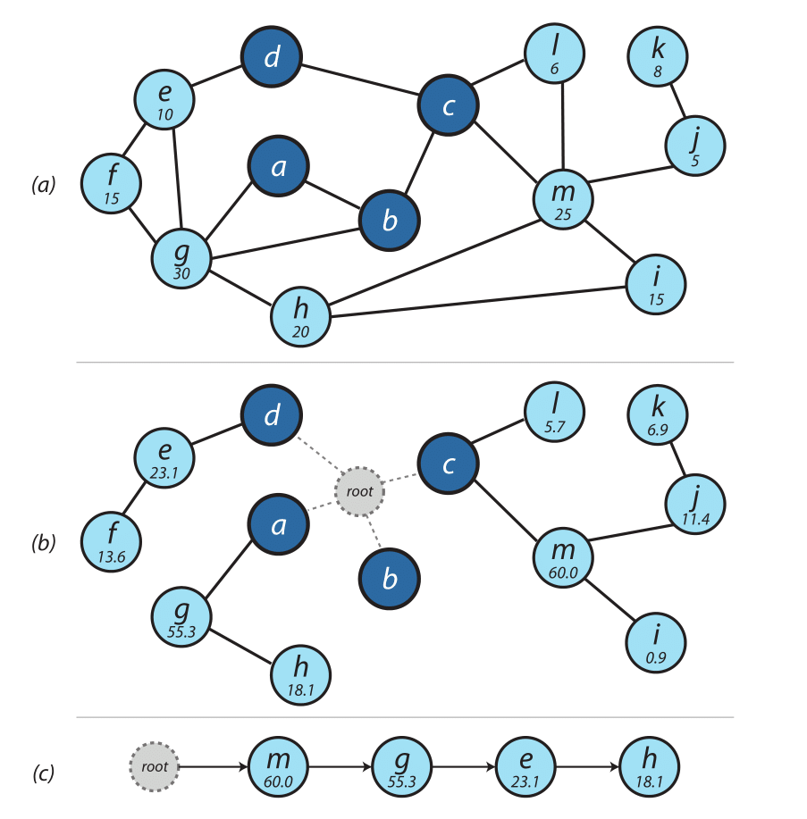
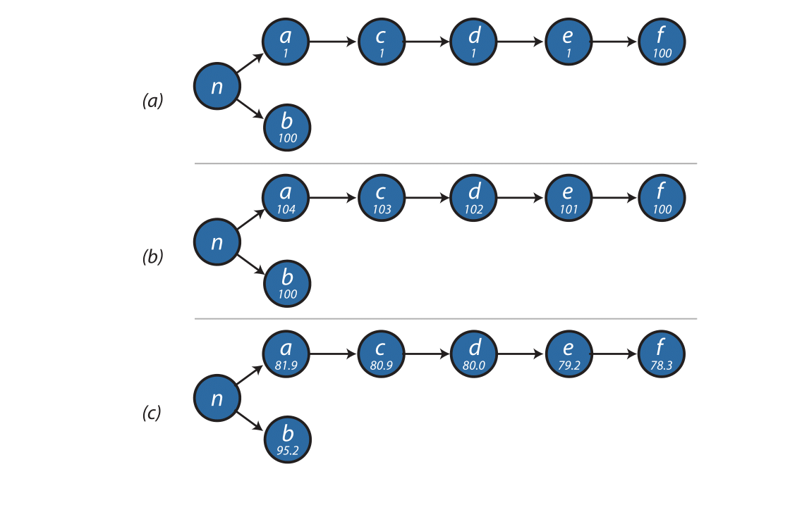

% Herramienta InCrease
% Casallas - Espinel - Rodríguez

<!-- cap 4 -->
# PLANEACIÓN DE RED INCREMENTAL

<!-- 4.1 pág 53 -->
## INTRODUCCIÓN

En este capítulo, compartimos nuestra experiencia en el despliegue de una red
rural de banda ancha BWA, en esta se concluyó que incluso para un pequeño banco
de pruebas como Tegola, la planificación empírica (ad-hoc) es ineficiente y
requiere mucho tiempo. Ahora elaboraremos el concepto de planeamiento de red
incremental y propondremos una herramienta de software que se denominará
`IncrEase` para guiarnos a través de este proceso.  La academia y la industria
ofrecen toneladas de software para el planeamiento de redes inalámbricas, en
general ofrecen identificar el mejor lugar para ubicar  las torres de
interconexión, esas herramientas a menudo no están disponibles ni son adecuadas
para comunicar pequeñas comunidades y pequeños WISP, que a menudo recurren a un
enfoque enpírico para la planificación de la red.
Nuestro enfoque se centra en las necesidades de operar WISP en áreas rurales, que se
enfrentan con el único reto de extender su cobertura con inversiones pequeñas
en un ambiente de ganancias limitadas. La clave para tales organizaciones es
identificar la estrategia de despliegue más económica para planear su red
mientras se toma en consideración su cobertura. 

El diseño de una red fija inalámbrica de banda ancha (BWA) es significativamente
diferente al de una red de banda ancha móvil y su proceso de planeación se puede
beneficiar de estas dos observaciones:

*  *Solamente la propagación en exteriores es relevante*, debido a que los
   dispositivos de los clientes (Equipamiento de las instalaciones del
   cliente *Customer Premises Equipment*) están instalados tipicamente en los
   tejados. Teniendo en cuenta esta noción se puede decir que esto ayuda a
   disminuir costos o (incrementar la cobertura con el mismo costo). Debido a la
   menor pérdida de trayectoria,  ya que la señal no tiene que penetrar las
   paredes, varios estudios de mercado recientes como (mason,2010) concluyen que
   el uso de Los CPE son la opción más rentable para llegar al "tercio final" de
   la población que reside en áreas rurales.

*   Los CPE son fijos y rara vez necesitan servicios de soporte nómada o
    móvil. *No hay necesidad de proporcionar cobertura en general* o
    sobreponer cobertura entre celdas, por lo que el *handover* no es necesario.
    El proceso de planificación puede concentrarse solo en ubicaciones
    residenciales donde se colocarán CPE al aire libre, por lo tanto, reduce el
    proceso de planificación, Simplificando de esta forma el aspecto del
    problema de planificación de cobertura. En comparación con los softwares de
    planificación de redes móviles, que generalmente calculan la cobertura en
    una cuadrícula de puntos igualmente espaciados, lo que requiere que cada uno
    de ellos esté por encima de un umbral de nivel de señal.

El modelo de redes BWA fijas rurales sigue invariablemente un modelo de dos niveles como se discutió al principio de esta tesis: un nivel de acceso de punto a multipunto (PMP) entre las torres de transmisión y los clientes. Y un nivel backhaul formado típicamente por enlaces punto a punto (PTP) o exclusivamente inalámbricos, los enlaces por cable rara vez están disponibles en las zonas rurales.

Mientras la planeación de redes inalámbricas es tradicionalmente un área muy activa por la comunidad investigación, el foco de investigación esta principalmente en redes de banda ancha móviles y redes de área local inalámbrica, como (Amaldi et al., 2003; Bosio et al., 2007; Amaldi et al., 2008; St-Hilaire, 2009). Mas importante mente, la planeación de red dirigido a un despliegue todos - a - la vez, en gran parte basado en una optimización usando métodos matemáticos y metaheurísticos como (Whitaker and Hurley, 2003; Bu et al., 2005; Raisanen and Whitaker, 2005; Gordejuela-Sanchez et al., 2009; Hurley et al., 2010).
Sin embargo, como discutiremos a continuación, este es un enfoque poco práctico para el despliegue de WISP rurales y organizaciones comunitarias. Las investigaciones enfocadas al dominio rural son limitadas, las cuales siguen el enfoque de implementación de todos a la vez. Algunos ejemplos incluyen (Sen and Raman, 2007; Panigrahi et al., 2008).

En cambio, abogamos por la importancia de la *planificación incremental*,con una metodología de diseño que guía a los WISP, -especialmente aquellos que operan en escenarios rurales-, en la planificación de su crecimiento ampliando su cobertura. Este enfoque está basado siguiendo las siguientes observaciones:

* El despliegue rural esta típicamente basado en la cobertura, en lugar de ser impulsado por la capacidad, una razón de la baja densidad de población de un área rural juega un factor positivo en mantener la capacidad requerida en una pequeña celda. Otra razón es que las WISP a menudo operan con un presupuesto ajustado, por lo tanto, deben anticipar la inversión desde la etapa inicial del despliegue, aun mas, en un entorno de limitada rentabilidad como una región rural, su prioridad es alcanzar un numero alto de clientes tan temprano como sea posible en la fase de despliegue, enfocando las áreas donde los clientes estén agrupados. Una razón similar además aplicable a una comunidad o una red junta, donde toda la población de una región necesita cobertura.
* La infraestructura de red es frecuentemente limitada o indisponible en áreas rurales, lo cual implica que el operador tenga que desplegar su propio 
    backhaul, lo que implica costos adicionales.
* Limitar el alcance geográfico en el que opera el WIS inicialmente es una manera efectiva de mantener el costo operacional auxiliar.

Mas allá de una inicial etapa de despliegue, el operador de red puede tomar dos acciones para extender su negocio: Incrementa la cobertura de red, o mejora las áreas ya existentes, en ambos casos, estas acciones son limitadas por el presupuesto y solo un pequeño conjunto de acciones puedan ser ejecutadas. Nuestro objetivo es, identificar sistemáticamente estos y sugerir al operador, una secuencia de acciones que resulten la mejor estrategia de despliegue, hacia este fin, nosotros desarrollaremos un código abierto llamado ‘IncrEase’ que permite planificar el paradigma de incremento en la práctica.
El resto del capítulo está organizado de la siguiente manera:  sección 4.2 presenta dos modos de operación soportados por la herramienta `IncrEase`: (1) `IncrEase targeted` , donde el operador selecciona una región especifica de cobertura, como parte de la expansión de la red, y (2)  `Búsqueda estratégica` , donde la herramienta guía al operador para decidir el orden de despliegue de sitios de transmisión en el horizonte de corto a largo plazo basado en la rentabilidad esperada.

En la sección 4.3 evaluamos la herramienta en la red NGI SpA (ver Sección 2.1.1 para más detalles sobre este WISP): Un escenario real de más de 8,000  torres desplegadas y comparar su tiempo de computo. Para validar la calidad de su salida, presentamos un conjunto de muestra de escenarios de planificación a ingenieros inalámbricos experimentados que trabajan en NGI Spa. Nosotros comparamos sus respuestas con las estrategias de despliegue propuestas por `IncrEase`, obteniendo resultados similares o mejores  en la mayoría de los casos.

## Herramienta `IncrEase`

`IncrEase` es un software de código abierto, implementado como un escritorio multiplataforma en java, este está basado en la NASA World Wind Java, un GIS de software abierto y una base de datos de graficas Neo4J. Esto permite importar un operador de red, modelos y estadísticas relacionadas con el cliente de red BWA en orden sistemáticamente identificando estrategias como mejoras y extender cobertura de red.
Un ejemplo de cómo el flujo de información esta presentado en la figura 4,1, que es un conjunto archivos XML que contienen información estadística que esta leía y analizada. En la implementación actual nosotros consideraremos tres fuentes de información.
La primera es demanda de cobertura:La lista de solicitud de cobertura recibida. Para posibles usuarios que están viviendo en áreas sin servicio, 
El segundo es el conjunto de detalles sobre aquellos usuarios nuevos que *fallaron en la etapa de instalación* debido a una cobertura insuficiente. Finalmente, nosotros también importaremos un registro de *llamadas de reportes a mesas de ayuda* a WISP y localización de los usuarios existentes. Algunos datos extras pueden ser importados capturando otros factores influyentes (disponibilidad DSL, cobertura 3G, datos demográficos).
`IncrEase` elabora cada fuente de datos en una forma de arreglo bidimensional cubriendo una región geográfica de interés, con cada valor de celda muchos “ítems” (usuarios actuales) que hacen parte de esta región. Los valores de celda están normalizados como un valor de la celda que tiene más ítems. `IncrEase` presenta visualmente tres arreglos 2D en los mapas como mapas de calor, y los combina a ellos en un promedio ponderado donde las ponderaciones están configuradas de acuerdo a cada métrica a la importancia relativa del operador. Estos mapas de calor combinado suministran una vista de las áreas que podrían beneficiarse más por la actualización de la red. En este caso el calor (celdas con altos valores en el arreglo 2D) es un indicador de cobertura inalámbrica inadecuada que puede ser quitada por una nueva torre de transmisión o un nuevo sector directivo. Los mapas de calor son almacenados en memoria y pueden acercarse, mostrarse u ocultarse seleccionando los elementos gráficos apropiados.

`IncrEase` puede importar una lista adicional de torres disponibles para ser instaladas como un inventario podría incluir torres que ya existan disponibles para arrendar de un operador de torres, o posibles lugares donde  se puedan construir nuevas torres. Una descripción XML de la topología del lugar, Incluyendo la ubicación y la altura de cada torre y la configuración y el número de antenas del sector también se pueden importar a `IncrEase`. Tal información es usada para generar una “capa de cobertura de red” con una granularidad configurable, el cálculo de línea de vista de cada torre existente y considerando el azimut e inclinación de los sectores existentes. Y un parámetro de máxima distancia que especifica el rango admisible para enlaces inalámbricos en el nivel de acceso.

Definimos las siguientes notaciones como recordatorio del capítulo:

* $T$: Es el conjunto de todas las torres (instaladas y viables)

* $N$: Es el subconjunto de $T$ de sólo torres que están actualmente utilizadas en la topología de red

* $H(t)$: Es la cantidad total de calor para la torre $t \in T$ . definidas como la suma de los valores cubiertos de la celda de calor por la torre.

* $C(t)$: es el costo de instalación de la torre $T$

AL iniciar el software realiza un paso de precálculo en memoria de las estructuras que se necesitan a largo plazo.  El más importante es G, un grafo  no dirigido de  "intervisibilidad"
En el cual los vértices son elementos de $T$. Dos torres de $t_1 t_2 \in T$ son conectados por un vértice que están en línea de vista y no más lejos que la máxima distancia permitida para enlaces punto a punto.  Como G es muy lejos de completar el grafo nosotros guardamos G en una base de datos interna de grafos.que permite para almacenamiento de grafos dispersos y debido a que el cálculo de línea de vista es computacionalmente intenso. La base de datos de grafos es almacenada persistentemente en el disco ahorrando tiempo en llamados subsecuentes posteriores, 

La herramienta ofrece dos modos operacionales 

1. `IncrEase` targeted
2. `Búsqueda estratégica`

Describiremos estos dos modos en las siguientes subsecciones:

### `IncrEase targeted` (modo `IncrEase`)

Los mapas de calor son una ayuda visual para el operador de red, ya que puede ver las áreas que más se pueden beneficiar, debido a una mejora en la cobertura del modo de operación `IncrEase` suministra el nivel más liviano de automatización disponible en `IncrEase`, dejando “el humano en el bucle” preguntándole al operador que visualmente seleccione en el mapa la visión geográfica donde la cobertura se debería mejorar.`IncrEase` entonces automáticamente identifica cuál es la celda más caliente en la región, definida como la que tiene mayor valor en la capa de calor combinada. La Aplicación determina el conjunto de torres más cercanas por ejemplo (20 en la configuración por omisión) del conjunto $T-N$ que están en línea de vista de la celda caliente para formar el conjunto de lugares candidatos que cubrirán el hotspot, considerando varias fuentes de torres, permite la selección de entre un gran número de posibles rutas de retorno, en comparación con enfocarse solo en la torre más cercana al punto de acceso (hotspot).
El software encuentra la mejor manera de conectar cada una de esas torres a la topología de red existente (i.e., el conjunto N) atravesando enlaces en el grafo $G$. La “mejor” solución es la ruta que proporciona el valor más bajo para la diferencia $c(t) - h(t)$ para cada torre t atravesada. En este cálculo, evitamos cuidadosamente contabilizar varias veces el “calor” asociado con una celda que puede estar en línea de vista con diferentes torres, ya que sesgaría los resultados. Así que consideramos el valor de estas celdas solo una vez.
Para pathfinding sobre el grafo $G$, IncrEase usa el algoritmo $A *$ (A-star). A utiliza la mejor búsqueda en primer lugar, basada en una función heurística de distancia más costo, encuentra la ruta de menor costo desde un nodo inicial a un nodo objetivo. 
Nuestra implementación tiene dos pequeños cambios con el algoritmo original $A *$. Primero, toma como entrada un conjunto de nodos de inicio 
(torres más cercanas a la celda más caliente en la región seleccionada) y un conjunto de nodos de objetivo en lugar de un solo inicio / final de nodos, ya que la ruta de retorno puede comenzar desde cualquiera de las ubicaciones candidatas y terminar en cualquiera de las torres existentes. Segundo, en el gráfo $G$, los costos son asociados con los vértices (es decir, torres) en lugar de bordes, por los que consideramos el costo de un borde ($i$, $j$) para que sea el nodo de salida $i$ (Skiena, 1998).

$A*$ requiere una función heurística que sea el límite mínimo inferior del posible costo de la ruta (Por ejemplo, para viajar entre dos ciudades, es la distancia por línea recta), así que en nuestro caso necesitamos diseñar una estimación de la mejor $C(t)-h(t)$ que se pueda lograr para el resto del camino desde una torre dada hasta la torre central. Nosotros adoptamos (l/d) *Cmin tal como heurística, donde l es la distancia en línea recta entre la torre actual que se está analizando y cualquiera de las torres centrales, d es la máxima distancia permitida para enlazar punto a punto (ambos en km) y Cmin el mínimo $C(t)-h(t)$ de todas las torres.
Finalmente, nosotros introducimos dos modificaciones a la función de costos presentada antes. Como $A*$ requiere costos de bordes no-negativos, sumamos un valor  positivo grande constante arbitrario a todos los $C(t)-h(t)$ valores. Por último, para permitir al usuario equilibrar la importancia de ahorrar dinero y ampliar la cobertura permitimos dos coeficientes variables $Co$ y $ho$ y definimos el costo como $Co*C(t)-ho*h(t)$. 

El resultado de la búsqueda de la mejor ruta se presenta como una ruta en el mapa junto con una indicación de texto de las torres que se desplegarán y su orden, como se muestra en la Figura 4.2 (d-f).

![Figura 4.2: Capturas de pantalla de la aplicación `IncrEase`: a) Demanda de cobertura mapa de calor; (b) Capa de cobertura, Mostrando las ubicaciones en LOS con cualquiera de las torres desplegadas; (c) Ubicación de las más de 8,000 torres en el set T; (d) Selección de un área de la GUI para el modo de operación Targeted Increase; (e-f) resultados de el algoritmo de aumento dirigido se muestran como texto y sobre el mapa; (g) Seleccionando el número de pasos a calcular para la para le modo de búsqueda estratégica;  (h) Resultados de una Búsqueda Estratégica se muestran en un mapa.](figure4-2.png)

###  `Búsqueda estratégica`

Mientras que `IncrEase targeted` es un modo semi automático que requiere que el
operador selecciones una región, el modo operacional de *búsqueda estratégica*
identifica y sugiere la mejor estrategia de expansión de la red. Asumimos que
la topología de la red evoluciona sobre intervalos discretos de tiempo
arbitrarios (meses, semanas) y el capital de inversión sobre un intervalo
discreto de tiempo del WISP está limitado por un parámetro discreto que
determina cuántos movimientos (instalaciones de torres) se pueden realizar en
cada intervalo de tiempo. El ánimo de la búsqueda estratégica es entonces
sugerir la mejor acción que el WISP pudiera tomar durante el siguiente
intervalo de tiempo. Una limitación práctica obia es el denominado *efecto
horizonte*: como en muchos juegos de inteligencia artificial, el número de
posibles estados es tan grande que sólo es posible buscar en una pequeña
porción de todo el potencial de movimientos en el horizonte de tiempo. El
algoritmo de búsqueda necesita ser capaz de reducir el número de posibles
estrategias para analizar, mientras limita el riesgo de excluir unas buenas
regiones.

A continuación se describe el algoritmo de búsqueda estratégica, que se lanza a
traveś del botón  "recalcular estrategias" en la interfaz de usuario de
`IncrEase`.

* **Paso 1** Un algoritmo de búsqueda de menor costo de múltiples fuentes se
ejecuta en el grafo de intervisibilidad $G$ para identificar los caminos de menor costo, con costos iniciando en $C(t) -h(t)$ como antes, a partir de cada uno de los nodos en el conjunto $T-N$ (las torres disponibles) a cualquiera de los nodos  en $N$. La salida es un árbol $R$, que intuitivamente suministra el mejor camino de la red existente a cada torre disponible. Para generar $R$, `IncreEase` añade un torre 'raíz' ficticia de cero costo conectada a cada torre en $N$ y ejecuta un algortimo de Dijkstra de la raíz a dada nodo en el grafo $G$. Un ejemplo se suministra en la figura 4.3 donde (a) muestra el grafo de inter visibilidad $G$ con nodos sombreados siendo aquellos que ya están instalados y (b) los caminos $R$ resultantes luego de la ejecución del algoritmo de Dijkstra.

* **Paso 2** El grafo $R$ se atravieza iniciando desde la raíz y en el transcurso la torres se etiquetan con el marcador 

$$ \frac{h(r) - c(r)}{(1+C)^{distancia(r)}} $$

donde $distancia(r)$ es la cuenta de las torres nuevas que se tiene que
atravezar para alcanzar $r$ a apartir de la 'raíz' de $R$ (torres que se
pueden conectar directamente a la red tienen distancia cero). Como no todas
las torres se pueden conectar inmediatamente a la red para ganar los
beneficios de la cobertura asociada a cada una de ellas, otras puden tener que
ser instaldas primero para servir como *back-hauling relays*. Para medir los
beneficios de cubrimientos futuros para hoy tomamos el concepto financiero de
valor presente neto (NPV) que aplica una rata de descuento constante  $C$ (por
ejemplo 5% 0.05) a las ganancias que ocurrirán en el futuro. 

Un ejemplo se muestra en la figura 4.4(a). Acá las dos torres $a$ y $b$ se
podrían instalar y conectar directamente al mástil existente $n$. Los nodos
$b$ y $f$ cada uno produce un beneficio $h(t) - c(t)$ de 100, mientras que las
otras torres suministran un beneficio mucho menor. El parámetro $C$ es una
medida de la voracidad de la selección: si picamos entre $a$ y $b$  basados en
el beneficio total que ellos y sus descendientes podrían producir , podríamos
decidir instalar la torre $a$ como se muestra en la figura 4.4(b). Sin embargo
si incrementamos el valor de $C$ al 5% $b$ se vuelve más atractivo como se ve
en la figura4.4(c). El NPV controla cuán lejos es posible ir para instalar
torres que dejen ganancia, permitiendole al propietario de la red afinar la
duración del retardo del beneficio.

* **Paso 3**. $R$ se atravieza una vez más esta vez desde las hojas hasta la
 raíz. Mientras se hace esto, actualizamos el puntaje de cada nodo $r$ a la
 suma de su propio puntaje y sus descendientes. se muestran los puntajes
 obtenidos después del paso tres en la figura 4.4(b) y 4.4(c).

Finalmente en cada clic en el botón de "próximo movimiento sugerido" `IncrEase`pregunta el número de movimientos (torres a ser instaladas). Entonces genera una lista ordenada $L$ figura 4.3(c) que incluye la torres que se deberían instalar inmediatamente ordendas según su puntaje de beneficio, calculado en el paso 3, posteriormente extrae el nodo superior de $L$  y finalmente lo presenta en el mapa de los resultados.

